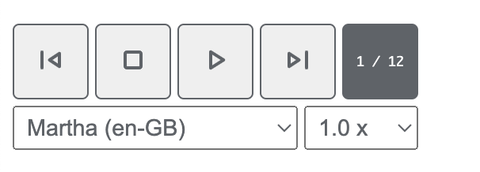

# Reader Control Web Component

A web component to easily control browser speech synthesis (TTS).



[Demo Page](https://calbert1209.github.io/reader_control/)

## Setup

1. add `reader.js` to your page via clone or [CDN](https://cdn.jsdelivr.net/gh/calbert1209/reader_control/reader.js)
2. wrap all contents that you want read aloud in a `<section class="readable"></section>` block.

## Use Via CDN

```
https://cdn.jsdelivr.net/gh/calbert1209/reader_control/reader.js
```

## Questions

- Q: Build system? Typescript?
- A: Nope. No build, no dependencies, just drop it in and go.

## Author

- [calbert1209](https://github.com/calbert1209)
